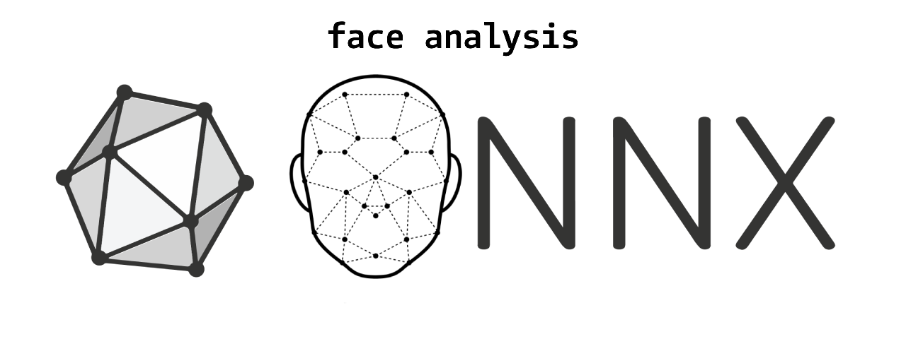
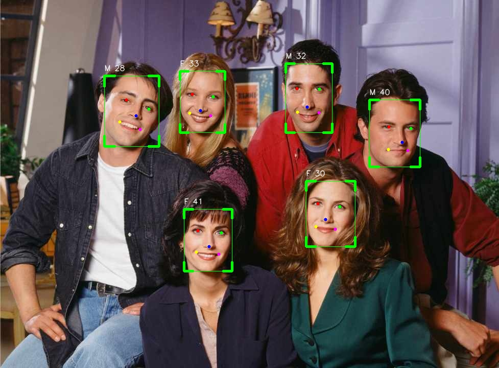

# Face Analysis (ONNX models)

 [](https://github.com/yakhyo/facial-analysis)

<div>
  
</div>

<video controls autoplay loop src="https://github.com/user-attachments/assets/d4bf1ed3-4f53-44ab-80ee-82e0df4d95e6
" muted="false" width="100%"></video>

This repository contains functionalities for face detection, age and gender classification, face recognition, and facial landmark detection. It supports inference from an image or webcam/video sources.

## Features

- [x] **Face Detection**: Utilizes [Sample and Computation Redistribution for Efficient Face Detection](https://arxiv.org/abs/2105.04714) (SCRFD) for efficient and accurate face detection.
- [x] **Gender & Age Classification**: Provides discrete age predictions and binary gender classification (male/female).
- [ ] **Face Recognition**: Employs [ArcFace: Additive Angular Margin Loss for Deep Face Recognition](https://arxiv.org/abs/1801.07698) for robust face recognition.
- [ ] **Facial Landmark Detection**
- [x] **Real-Time Inference**: Supports both webcam and video file input for real-time processing.

## Installation

1. Clone the repository:

```bash
git clone https://github.com/yakyo/facial-analysis.git
cd facial-analysis
```

2. Install the required dependencies:

```bash
pip install -r requirements.txt
```

3. Download weight files:

   a) Download weights from the following links:

   | Model          | Weights                                                                                           | Size    |
   | -------------- | ------------------------------------------------------------------------------------------------- | ------- |
   | ArcFace        | [w600k_r50.onnx](https://github.com/yakhyo/facial-analysis/releases/download/v0.0.1/w600k_r50.onnx) | 166 MB  |
   | SCRFD          | [det_2.5g.onnx](https://github.com/yakhyo/facial-analysis/releases/download/v0.0.1/det_2.5g.onnx)   | 3.14 MB |
   | SCRFD          | [det_500m.onnx](https://github.com/yakhyo/facial-analysis/releases/download/v0.0.1/det_500m.onnx)   | 2.41 MB |
   | SCRFD(default) | [det_10g.onnx](https://github.com/yakhyo/facial-analysis/releases/download/v0.0.1/det_10g.onnx)     | 16.1 MB |
   | GenderAge      | [genderage.onnx](https://github.com/yakhyo/facial-analysis/releases/download/v0.0.1/genderage.onnx) | 1.26 MB |

   b) Run the command below to download weights to the `weights` directory (Linux):

   ```bash
   sh download.sh
   ```

## Usage

```bash
python main.py --source assets/in_video.mp4
                        assets/in_image.jpg
                        0 # for webcam
```

`main.py` arguments:

```
usage: main.py [-h] [--detection-weights DETECTION_WEIGHTS] [--attribute-weights ATTRIBUTE_WEIGHTS] [--source SOURCE] [--output OUTPUT]

Run face detection on an image or video

options:
  -h, --help            show this help message and exit
  --detection-weights DETECTION_WEIGHTS
                        Path to the detection model weights file
  --attribute-weights ATTRIBUTE_WEIGHTS
                        Path to the attribute model weights file
  --source SOURCE       Path to the input image or video file or camera index (0, 1, ...)
  --output OUTPUT       Path to save the output image or video
```

<div align="center">
  
</div>

## Reference

1. https://github.com/deepinsight/insightface
